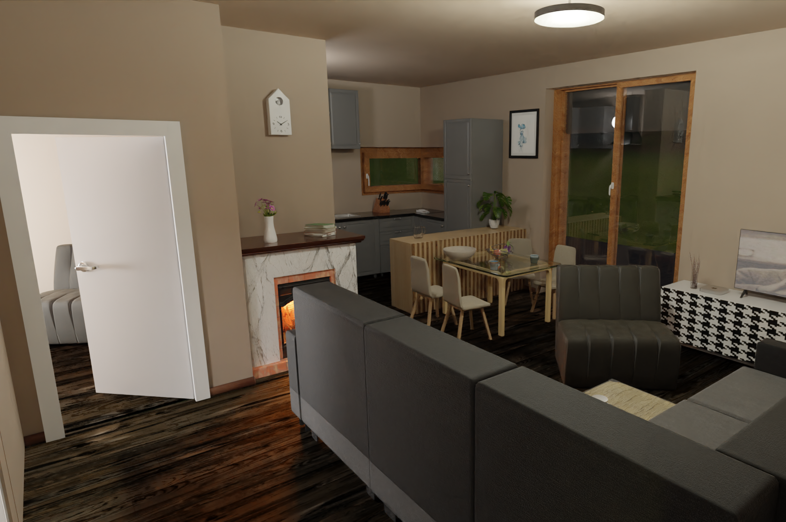
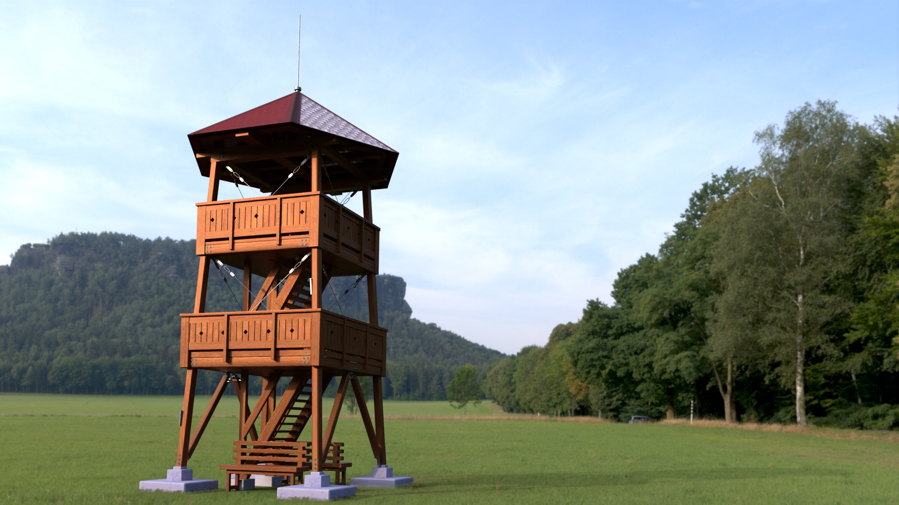

<h1 align="center">Hi 👋, I'm Radoslav Šersťuk</h1>
<h3 align="center">A software developer from Slovakia  </h3>

- 🖋 My hobby is 3D visualization, 3D printing and software programming using      

- 🤖 I have experience in CAD drawing, mechanical engineering and 3D printing software [Fusion360](https://www.autodesk.com/products/fusion-360/overview), [Creo](https://www.ptc.com/en/products/creo/parametric), [Cura](https://ultimaker.com/software/ultimaker-cura) 

- :desktop_computer: My home setup is currently running on    

<h3 align="left">Contact me:</h3>

<h3 align="left">Languages and Tools:</h3>

    

&nbsp;

<h3 align="left">Competitive programming challenges:</h3>

 <a   </a>

  
   

<h3 align="left">My current python projects:</h3>

Game with 8 AI opponents and 4 human players

  

 

Solar calculator 

  

 

#### Solar Calculator 

  

 

#### Weather AVG

  

Website 

  

 

<h3 align="left">3D visualizations (Blender):</h3>

 
House interior #1

  

 

House interior #2

  

 

House

  

 

Tourist tower 

  

 

Second tourist tower 

  

 
